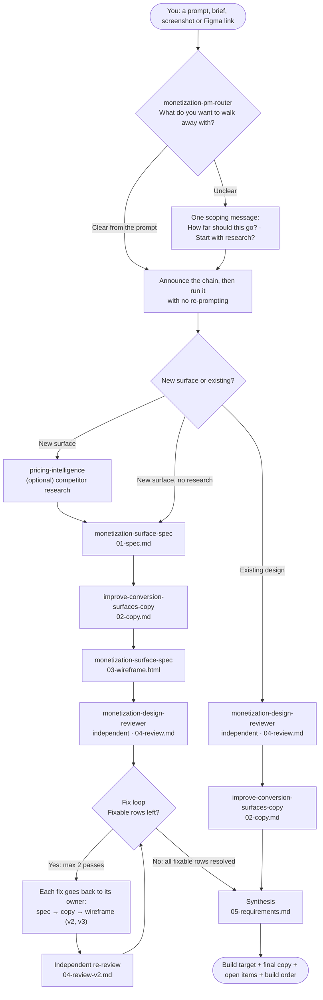

# Growth Monetization Plugin

[](https://claude.ai/code)
[](https://cursor.com)
[](#the-skills)
[](https://monday.com)

A monetization copilot for growth product squads — research how competitors price, spec and wireframe any monetization surface, score designs against a CRO rubric, and write benefit-led conversion copy. Every command produces a real artifact. Skills chain into each other. Your work accumulates in a single folder you can hand to design or engineering.

Built for: pricing pages · paywalls · upgrade flows · credit/consumption UI · trial flows · cancellation flows

---

## How it works

Five skills, one router. You can run the whole flow end to end, a few skills in a row, or a single skill on its own. Every path produces real files you can hand to design or engineering.



The router can stop the chain early. "Spec + copy" ends at `02-copy.md`. "Up to a wireframe" ends at `03-wireframe.html`. "Research only" ends at the research doc.

### Three ways to use it

| You want | Do this | What runs |
|----------|---------|-----------|
| **The full flow.** From an idea (or a live page) to an implementation-ready requirements doc | `/monetization-pm-router` + describe the surface, or share a screenshot / Figma link | Scoping → research (optional) → spec → copy → wireframe → review → fix loop → requirements |
| **Part of the flow.** For example spec + copy only, or up to a wireframe | `/monetization-pm-router` and pick "how far" when it asks, or say it upfront: "spec and copy for…", "wireframe a…" | Only the steps up to where you chose to stop |
| **One skill.** You know exactly what you need | Call the skill directly: `/pricing-intelligence`, `/monetization-surface-spec`, `/improve-conversion-surfaces-copy`, `/monetization-design-reviewer` | Just that skill. Its artifact ends with a `→ Next step` prompt you can paste to keep going |

You never have to use the router. Every skill works on its own, reads what's already in the feature folder, and continues from there.

### Who does what

| Skill | Responsible for | Produces | Never does |
|-------|----------------|----------|------------|
| `monetization-pm-router` | Working out what you want to walk away with, building the chain, running it without stops, running the fix loop, and writing the final requirements doc | `05-requirements.md` | Write copy, score designs |
| `pricing-intelligence` | Competitor pricing, market landscapes, model benchmarks (e.g. how companies sell AI credits), battlecards, change monitoring | `research/{topic}-{YYYY-MM}.md` | Spec or design anything |
| `monetization-surface-spec` | The spec (trigger, cohort, layout, edge cases) and the low-fi HTML wireframe, plus revisions of both when a review sends fixes back | `01-spec.md`, `03-wireframe.html` (+ `-v2`…) | Write final copy. It names the reason and hands off |
| `improve-conversion-surfaces-copy` | Every word the user will read: 2–3 options per element, one ★ recommended, all grounded in a real reason people buy | `02-copy.md` (+ `-v2`…) | Layout, hierarchy or scoring |
| `monetization-design-reviewer` | Scoring a design against an 8-dimension CRO rubric, a ranked fix list with a **Fix path** per row, and verifying fixes on re-review | `04-review.md` (+ `-v2`…) | Write the fix itself. It routes the fix to the skill that owns it |

### Why the review loops

A review that only lists problems hands dev a wrong wireframe plus a to-do list. In a new-surface chain, the router instead sends each fixable finding back to the skill that owns it. A fresh reviewer that sees only the files (not the reasoning that produced them) then checks the fixes. The loop exits when every fixable row is resolved, with a maximum of 2 passes. Findings that need a human decision (a price, a policy, an eng answer) skip the loop and become Open items with an owner.

Copy runs *before* the wireframe, not after the review. So the wireframe you look at, and the review that scores it, both reflect real language, not bracketed placeholder text.

---

## Installation

### Claude Code (recommended)

```bash
/plugin marketplace add ohadfrank-m/growth-monetization
/plugin install growth-monetization@growth-monetization
```

Skills load automatically. Invoke by name or let `/monetization-pm-router` route for you.

To try locally before installing:

```bash
claude --plugin-dir /path/to/growth-monetization
```

To update when new skills ship:

```bash
/plugin update growth-monetization@growth-monetization
```

### Cursor

Clone the repo, then add to your project's `.cursor/rules/`:

```bash
git clone https://github.com/ohadfrank-m/growth-monetization
```

Copy `CLAUDE.md` content into `.cursor/rules/monetization.mdc`. Add required MCP servers to `~/.cursor/mcp.json` — see [mcp-setup.md](mcp-setup.md).

### Claude Desktop / Claude.ai

Add as a custom skill or copy skill content into your project context. Skills work without the plugin format — paste the SKILL.md content of any individual skill as a system prompt or project instruction.

---

## MCP connections (all optional)

None of these are required to use the plugin — every skill still produces a real artifact without them, using web search and screenshots instead. Connect an MCP when you want the higher-fidelity path it unlocks; skip it and the skill tells you what's reduced, not just that something failed.

| MCP | What it unlocks | Without it | How to connect |
|-----|-----------------|-----------|----------------|
| **monday.com** | Every artifact this plugin produces (research, specs, reviews, copy) logs automatically to boards on monday.com — so the work compounds in one shared place instead of living only in local files or scattered Slack threads. | Skills still write every artifact to `.monetization/` locally — you just log it manually if you want it on a board. | Add `https://mcp.monday.com/mcp` as a remote MCP server |
| **PricingSaaS** | Structured, current competitor pricing data — live plans, historical change diffs, watchlists, pricing-news feed. This is what makes `pricing-intelligence` fast and precise instead of a slow manual Google-and-guess exercise, and it's the only source with real historical diffs (before/after a pricing change, dated). | Falls back to enrichment-only research — Wayback Machine, changelogs, sentiment, job postings. Still usable, but slower and with no structured change history. | Add `https://mcp.pricingsaas.com` — see [mcp-setup.md](mcp-setup.md) |
| **Figma** | Pull a design directly from a Figma link or frame — layer structure, exact copy text (not read off pixels), and variable bindings, so `monetization-design-reviewer` can catch hardcoded colors/spacing that have drifted from Vibe design tokens. | Paste a screenshot instead — full visual review still works, you just lose token-binding checks and have to transcribe copy by eye instead of reading it exactly. | Add `https://mcp.figma.com/mcp` |
| **Slack** | The weekly pricing digest (`pricing-intelligence`) posts straight to a channel your team already watches, instead of living only in a chat session. | Digest is delivered directly in chat — same content, you copy it over yourself. | See your Slack app's MCP setup |
| **Web search** | Enrichment sources for `pricing-intelligence` — Wayback Machine snapshots, product changelogs, earnings-call commentary, sentiment from Reddit/G2/HN. This is what grounds research in evidence beyond whatever PricingSaaS alone returns. | Research is limited to PricingSaaS/monday.com MCP data alone — meaningfully reduced coverage on anything PricingSaaS doesn't track. | Native to Claude — no setup needed |

Skills degrade gracefully when an MCP is unavailable and tell you what's affected — they never fail silently.

---

## The skills

### `/monetization-pm-router` — Router

The entry point. It works out which deliverables you want (research doc, spec, copy, wireframe, review, requirements). If the prompt makes that clear, it doesn't ask. If it doesn't, it sends one scoping message: *how far should this go?* and *start with competitor research?* It then runs the chain without stopping between steps. For a new surface it runs the fix loop, and it finishes by synthesizing everything into one doc a designer and engineer can build from.

**What you get:** `05-requirements.md`, which contains:
- the **build target** (the approved wireframe version)
- final copy strings: verbatim ★ picks, each next to the line it replaces
- what was already fixed in the loop
- remaining design changes
- open items with owners
- a sorted build order

Every row traces back to the review row it came from, and the router re-checks the reviewer's factual claims before they go in.

Claude's `/` menu lists each skill separately — there's no plugin-level command. Skills appear namespaced by plugin, so typing `/growth-monetization` lists all five; `/growth-monetization:monetization-pm-router` is the one to pick. (This README uses the short skill names.) Sharing a design with `/monetization-design-reviewer` directly also runs the full chain unless you say "review only".

---

### `/pricing-intelligence` — Competitive research

Research how any company prices. Map an industry landscape. Benchmark a pricing model ("how do AI companies sell credits?"). Monitor a watchlist for changes. Generate a pricing battlecard. Tear down a competitor's pricing page.

**Requires:** PricingSaaS MCP + web search

**Workflows:**

| What you ask | What you get |
|-------------|-------------|
| "How does Notion price?" | Company deep-dive — plans, packaging logic, history, what it means for monday.com |
| "How do AI companies sell credits?" | Model benchmark — credit unit names, package sizes, rollover policies, top-up UX across 8+ tools |
| "Map the work management pricing landscape" | HTML landscape report — all players, price bands, model patterns, market-level signals |
| "What changed in pricing this week?" | Weekly digest — watchlist changes, key moves, signal vs. noise |
| "Tear down Asana's pricing page" | Page teardown — hierarchy, copy psychology, what works and what doesn't |
| "Build a battlecard: monday vs Asana" | Battlecard — plan comparison, objection handling, negotiation intelligence |

Standalone runs log to the **Pricing Intelligence** board on monday.com. Inside a router chain, logging is offered once at the end instead of posted mid-chain.

---

### `/monetization-surface-spec` — Spec and wireframe

Produce a complete spec and low-fi HTML wireframe for any monetization surface. Works from a brief ("I need a credit depletion modal for Pro users"), a Figma link, or a screenshot of an existing design. **Runs twice per surface** — once to write the spec, again after copy exists to build the wireframe around it. Don't collapse these into one pass.

**Requires:** Figma MCP (when working from an existing design)

**Surface types covered:**

| # | Surface | Triggered when |
|---|---------|---------------|
| 1 | Pricing page | Plan comparison — public or in-app |
| 2 | Paywall / feature gate | User tries to access a locked feature |
| 3 | Promotion | Discount, limited-time offer, upsell |
| 4 | Tier upgrade trigger | Usage limit hit, seat expansion |
| 5 | Credit / consumption UI | Running low, credit meter, top-up flow |
| 6 | Cancellation flow | User initiates cancel or downgrade |
| 7 | Trial flow | Trial start, mid-trial nudge, expiry |

**What you get:**

- `01-spec.md` (first invocation) — full structured spec: trigger condition, user cohort, section-by-section layout table, copy strategy (names the reason and direction, doesn't write final copy), success metrics, edge cases (credit debt, admin-gated purchase, mobile, repeat exposure, enterprise)
- `03-wireframe.html` (second invocation, after copy): a low-fi interactive wireframe with every state, annotated and built with the real copy from `02-copy.md`, not bracketed placeholder text. Each state opens from the URL hash (`#depleted`) so it can be rendered for review.
- `01-spec-v2.md` / `03-wireframe-v2.html` (fix loop): only the review rows sent back are applied, and each change is pinned with its row number

---

### `/improve-conversion-surfaces-copy` — Conversion copy

Rewrite persuasive copy so every line maps to a real reason people buy, not a feature description. Works on headlines, CTAs, upgrade prompts, pricing tiers, and email. Picks up the reason and direction named in a spec automatically. **Runs twice per surface** — a first pass right after the spec (this is what the wireframe gets built from), and a revision pass if the design review flags a specific line.

**What you get:**

- `02-copy.md` (first pass) — 2–3 options per element, varied by angle, with one marked ★ Recommended and why. Real, ship-ready lines — the wireframe is built from these, not from a placeholder.
- `02-copy-v2.md`, `-v3` (revision passes: the fix loop, or once for 🟡 rows after it): a targeted fix to the flagged lines, not a fresh draft

---

### `/monetization-design-reviewer` — CRO design review

Score any monetization design, screenshot, Figma frame, or wireframe against an 8-dimension CRO rubric (value clarity, timing, copy, friction, trust, escape hatch, hierarchy, mobile), weighted by surface type. Delivers a verdict and a single ranked punch list with severity, category, and effort for every fix. Inside the plugin's own pipeline, this scores the *real* spec, copy, and wireframe together — not a wireframe built from placeholder text.

**Requires:** Figma MCP (optional — screenshots work too)

**What you get:** `04-review.md`, containing:
- a weighted score out of 100, plus a projected score if the Critical and Major fixes ship
- a ship / don't-ship verdict
- a ranked improvement table where every row has a **Fix path** (`copy`, `wireframe`, `spec`, `design team`, or `blocked — {owner}`), which is how the router knows where to send each fix
- one benchmark example

Inside the router it runs in a fresh subagent, so it isn't grading work it wrote. On re-review (`04-review-v2.md`) it checks each fix and ends with `Exit loop` or `Another pass`. Called directly, it continues into copy rewrites and `05-requirements.md` unless you ask for the review only.

---

## Your work persists

Every artifact lands in `.monetization/` in your working directory, numbered in workflow order:

```
.monetization/
├── credit-depletion-modal/
│   ├── 01-spec.md            ← /monetization-surface-spec (names the reason, hands off)
│   ├── 02-copy.md            ← /improve-conversion-surfaces-copy (real copy; the wireframe is built from this)
│   ├── 03-wireframe.html     ← /monetization-surface-spec (re-invoked, built from 02-copy.md)
│   ├── 04-review.md          ← /monetization-design-reviewer (independent; a Fix path on every row)
│   ├── 01-spec-v2.md         ← fix loop: only the spec rows the review sent back
│   ├── 02-copy-v2.md         ← fix loop: only the copy rows the review sent back
│   ├── 03-wireframe-v2.html  ← fix loop: rebuilt; becomes the build target once approved
│   ├── 04-review-v2.md       ← independent re-review: verifies each fix, exits or loops (max 2 passes)
│   ├── renders/              ← every wireframe state, desktop + true 375px, for the reviewer
│   └── 05-requirements.md    ← /monetization-pm-router synthesis (what design + eng build from)
├── trial-expiry-screen/    ← existing design reviewed from a screenshot (no fix loop; it's your live design)
│   ├── input/              ← screenshots, or captures of a public page
│   ├── 04-review.md
│   ├── 02-copy.md
│   └── 05-requirements.md
└── research/
    ├── notion-pricing-2026-09.md
    └── ai-credits-benchmark-2026-09.md
```

Every file uses the same header block (plugin, skill, feature, cohort, date, status). Returning to a feature later, the skill detects what's already there and picks up from the next step. Iterations get a version suffix instead of overwriting.

---

## Key principles

**Artifacts over answers.** Every skill produces a real deliverable — a spec doc, a wireframe, a research report — not a chat response. The artifact is what you hand to design or engineering.

**Skills chain, or stand alone.** Through the router, skills run back to back with no re-prompting and end in one requirements doc. Run a skill on its own and its artifact ends with a `→ Next step` block and a copy-pasteable prompt instead.

**Reviewed until right, by someone who didn't write it.** In a new-surface chain, the reviewer is a fresh subagent. Its findings go back to the skill that owns them, and it re-checks until every fixable row is resolved, with a maximum of 2 passes. Dev gets a wireframe that's already corrected, not a list of corrections.

**monday.com context always applied.** AI credits, Vibe design tokens, tier structure, cohort differences (new user vs. existing), B2B PLG dynamics (IC hits the wall, admin buys) — all applied automatically without being asked.

**One source of truth for monday.com facts.** Plans, prices, AI credit packages, gating, and trial terms live in [`context/monday-context.md`](context/monday-context.md). Skills cite it instead of guessing. It has a named owner and a changelog — see the file header for how to update it.

**Copy is always handed off — and it runs before the wireframe, not after the review.** No skill but `/improve-conversion-surfaces-copy` writes final copy. The spec names the persuasion angle and the reason from the 15 reasons people buy; the copy skill writes the actual lines next, before any wireframe exists. The wireframe is built from that real copy, and the design review scores the real thing — not a placeholder that gets swapped out later.

---

## Repo structure

```
growth-monetization/
├── .claude-plugin/
│   ├── plugin.json
│   └── marketplace.json
├── CLAUDE.md                          ← plugin-wide rules and conventions
├── context/
│   └── monday-context.md              ← monday.com source of truth (owned, versioned)
├── playbooks/                         ← CRO knowledge source of truth, one file per surface type
│   └── ...                            ← benchmarks, best-in-class examples, anti-patterns — cited by spec + reviewer, never duplicated
├── templates/                         ← artifact header + research and spec templates
├── skills/
│   ├── monetization-pm-router/        ← router + synthesis
│   ├── pricing-intelligence/
│   ├── monetization-surface-spec/
│   ├── monetization-design-reviewer/
│   └── improve-conversion-surfaces-copy/
└── mcp-setup.md
```

## Contributing

- **Updating monday.com facts:** edit `context/monday-context.md`, bump `last-updated`, add a changelog row
- **Updating CRO best-practice knowledge** (a benchmark, a best-in-class example, an anti-pattern): edit the matching file in `playbooks/`. It's cited by both `monetization-surface-spec` and `monetization-design-reviewer` — never re-derive or copy it into a skill's own `references/`. Tag every claim `[Verified]` / `[Reported]` / `[Teardown needed]` and date your sources — the skills are instructed to cite according to those tags. See [playbooks/README.md](playbooks/README.md).
- **Adding a playbook** (e.g. trial flows): it isn't finished until it carries the mandatory AI-native reference set — Clay, Figma, ClickUp, and Claude teardowns in the standard shape, an at-a-glance comparison, a copy bank, and dated sources. A skill shouldn't cite a playbook that's missing it. See [playbooks/README.md](playbooks/README.md).
- **Changing a skill:** keep `SKILL.md` lean; put mechanics specific to that skill in the skill's `references/`; put anything a second skill would also need in `playbooks/` instead
- **Adding a skill:** add a folder under `skills/`, then add it to the router table in `skills/monetization-pm-router/SKILL.md` and to this README

## Coming in Wave 2

- `/monetization-data` — Kremer-backed conversion analytics: trial→paid funnels, credit consumption by segment, paywall performance, cohort upgrade analysis
- `/monetization-pm` — PRD writer, A/B experiment designer, pricing model workshop, launch readiness checklist

---

## Security

These files are instructions for local AI tools. Review skills before using them in sensitive contexts. Keep your API keys and MCP credentials on trusted machines.

---

## Built by monday.com Growth

Questions or contributions: open an issue or submit a PR.
