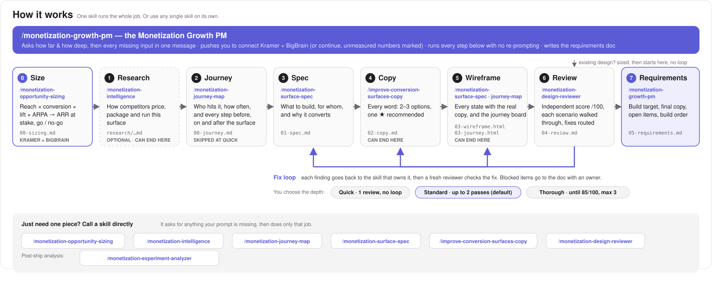

# Growth Monetization Plugin

[](https://claude.ai/code)
[](https://cursor.com)
[](#the-skills)
[](https://monday.com)

A monetization copilot for growth product squads. Hand the **Monetization Growth PM** a surface and it does the full product work — competitor research, spec, conversion copy, wireframe, an independent CRO review that loops until the fixes land, and one requirements doc design and engineering can build from. Or call any single skill on its own when you only need one piece.

Built for: pricing pages · paywalls · upgrade flows · credit/consumption UI · trial flows · cancellation flows

---

## How it works



### Two ways to use it

| You want | Do this | What happens |
|----------|---------|--------------|
| **The full product work** — from an idea (or a live page) to an implementation-ready requirements doc | `/monetization-growth-pm` + describe the surface, or share a screenshot / Figma link | The Growth PM works out how far and how deep to go (asking one short message only if your prompt doesn't say), runs every step without re-prompting, and delivers `05-requirements.md`. You can also stop it early: "spec and copy for…", "wireframe a…" |
| **One piece of the work** — you know exactly what you need | Call the skill directly: `/monetization-intelligence`, `/monetization-surface-spec`, `/improve-conversion-surfaces-copy`, `/monetization-design-reviewer` | Just that skill. It first checks it has what a top-tier output needs and asks for anything missing — all in one message — then produces its artifact, ending with a `→ Next step` prompt if you want to keep going |

You never have to use the Growth PM, and you never have to use every skill. Every skill reads what's already in the feature folder and picks up from there.

### How the Growth PM scopes a run

When your prompt is clear ("wireframe a credit depletion surface for Pro"), it announces the plan and starts. When it isn't, it asks one message with up to three pick-one questions:

| Question | Options |
|----------|---------|
| **How far should this go?** | New surface: spec + copy · up to a wireframe · all the way to a requirements doc. Existing surface: review + fixed copy + requirements · review only · start fresh · redesign all the way |
| **Start with a benchmark of how competitors run this surface?** | Yes / No — recommended for a new surface; the spec's flow map is then built from real competitor flows |
| **How thorough should the review be?** *(only when the chain reviews a wireframe it built)* | Standard *(recommended)* · Quick · Thorough — see below |

If the surface is live and public (e.g. monday.com/pricing), it captures the page itself instead of asking for a screenshot. On a new surface where research wasn't chosen, the announcement adds one line — `Say "add research" to benchmark competitors first` — so you can still add it without a question up front. A research-only ask ends at the research doc.

### The review loop, and how deep it goes

A review that only lists problems hands dev a wrong wireframe plus a to-do list. So for a new surface, the Growth PM sends every fixable finding back to the skill that owns it — copy lines to the copy skill, layout and states to the wireframe, a wrong trigger or missing state to the spec — and a **fresh reviewer that sees only the files** (not the reasoning that produced them) checks the fixes.

| Depth | What happens | Stops when |
|-------|--------------|-----------|
| **Quick** | One review, no loop. One copy pass writes the strings every finding needs; the rest go into the requirements doc as design changes on top of the v1 wireframe, and the fixed wireframe is offered at the end | After the review |
| **Standard** *(default)* | Critical and major findings loop back | Every fixable 🔴/🟠 finding is resolved and the re-review found no new 🔴/🟠 — max 2 passes. Polish (🟡) findings get one copy pass after the loop, then go into the doc |
| **Thorough** | Every fixable finding loops, polish included | Score ≥85/100 and every fixable finding resolved — max 3 passes, earlier if only human-blocked items remain |

Findings that need a human — a price, a policy, an engineering answer — never loop; they go into the requirements doc as Open items with an owner. In a live test, a credit-depletion surface went 67 → 85 → 91 over two Standard passes without a human in the loop.

If the environment can't run an independent reviewer (e.g. a chat session with no subagents), the Growth PM says so up front, labels every score **self-graded**, and never calls a self-graded score "ship it".

### Who does what

In the order they run:

| Skill | Responsible for | Produces | Never does |
|-------|----------------|----------|------------|
| `monetization-growth-pm` | The PM on the job: scopes how far and how deep, runs every skill below in order, runs the fix loop, keeps the artifact ledger, and writes the final requirements | `05-requirements.md` | Write copy or score designs itself |
| `monetization-intelligence` | How competitors monetize and how they run each surface: surface benchmarks (e.g. five competitors' cancellation flows, screen by screen), full monetization teardowns, model benchmarks, landscapes, battlecards, change monitoring | `research/{topic}-{YYYY-MM}.md` | Spec or design anything |
| `monetization-surface-spec` | What to build: trigger, cohort, the screen-by-screen flow with its friction points, layout, edge cases — then the low-fi HTML wireframe of every state, and revisions of both when a review sends fixes back | `01-spec.md`, `03-wireframe.html` | Write final copy — it names the reason and hands off |
| `improve-conversion-surfaces-copy` | Every word the user reads: 2–3 options per element, one ★ recommended, grounded in a real reason people buy | `02-copy.md` | Layout, hierarchy, or scoring |
| `monetization-design-reviewer` | Scoring against an 8-dimension CRO rubric, a ranked fix list with a **Fix path** per row, and verifying fixes on re-review | `04-review.md` | Write the fix — it routes it to the skill that owns it |

Copy runs *before* the wireframe, not after the review — so the wireframe you look at, and the review that scores it, both reflect real language, never bracketed placeholder text.

---

## Installation

### Claude Code (recommended)

```bash
/plugin marketplace add ohadfrank-m/growth-monetization
/plugin install growth-monetization@growth-monetization
```

Skills load automatically. Run `/monetization-growth-pm` for the full flow, or call any skill by name.

To try locally before installing:

```bash
claude --plugin-dir /path/to/growth-monetization
```

To update when new skills ship:

```bash
/plugin update growth-monetization@growth-monetization
```

### Cursor

Clone the repo, then add to your project's `.cursor/rules/`:

```bash
git clone https://github.com/ohadfrank-m/growth-monetization
```

Copy `CLAUDE.md` content into `.cursor/rules/monetization.mdc`. Add required MCP servers to `~/.cursor/mcp.json` — see [mcp-setup.md](mcp-setup.md).

### Claude Desktop / Claude.ai

Add as a custom skill or copy skill content into your project context. Skills work without the plugin format — paste the SKILL.md content of any individual skill as a system prompt or project instruction.

---

## MCP connections (optional)

Only web search is needed, and it's built in. None of the MCPs are required — every skill still produces a real artifact without them, using web search and screenshots instead. Connect an MCP when you want the higher-fidelity path it unlocks; skip it and the skill tells you what's reduced, not just that something failed.

| MCP | What it unlocks | Without it | How to connect |
|-----|-----------------|-----------|----------------|
| **monday.com** | `monetization-intelligence` can log its research to the Pricing Intelligence board on monday.com (it asks first), so competitive work compounds in one shared place instead of living in local files or Slack threads. Inside a Growth PM chain, logging is offered once at the end, never posted mid-run. | Every artifact is still written to `.monetization/` locally — you log it yourself if you want it on a board. | Add `https://mcp.monday.com/mcp` as a remote MCP server |
| **PricingSaaS** | Structured, current competitor pricing data — live plans, historical change diffs, watchlists, pricing-news feed. This is what makes `monetization-intelligence` fast and precise instead of a slow manual Google-and-guess exercise, and it's the only source with real historical diffs (before/after a pricing change, dated). | Falls back to enrichment-only research — Wayback Machine, changelogs, sentiment, job postings. Still usable, but slower and with no structured change history. | Add `https://mcp.pricingsaas.com` — see [mcp-setup.md](mcp-setup.md) |
| **Figma** | Pull a design directly from a Figma link or frame — layer structure, exact copy text (not read off pixels), and variable bindings, so `monetization-design-reviewer` can catch hardcoded colors/spacing that have drifted from Vibe design tokens and the wireframe can name real tokens instead of "token TBD". | Paste a screenshot instead — full visual review still works, you just lose token-binding checks and have to transcribe copy by eye instead of reading it exactly. | Add `https://mcp.figma.com/mcp` |
| **Slack** | The weekly pricing digest (`monetization-intelligence`) comes formatted as a paste-ready Slack message for the channel your team watches. | Digest is delivered in chat — same content, formatted for pasting. | See your Slack app's MCP setup |
| **Web search** | Enrichment sources for `monetization-intelligence` — Wayback Machine snapshots, product changelogs, earnings-call commentary, sentiment from Reddit/G2/HN. This is what grounds research in evidence beyond whatever PricingSaaS alone returns. | Research is limited to PricingSaaS/monday.com MCP data alone — meaningfully reduced coverage on anything PricingSaaS doesn't track. | Native to Claude — no setup needed |

Skills degrade gracefully when an MCP is unavailable and tell you what's affected — they never fail silently.

---

## The skills

Listed in the order the Growth PM runs them. Each one also works on its own.

### `/monetization-growth-pm` — the Monetization Growth PM

The full product work in one command. It scopes the job (how far, how deep), runs research → spec → copy → wireframe → independent review → fix loop, and synthesizes everything into one doc a designer and engineer can start from without opening anything else. After every step it prints a one-line **ledger** of the current version of each artifact, so it's always clear which spec, copy, and wireframe are the latest — even in a chat session with no real files.

**What you get:** `05-requirements.md` — the **build target** (the approved wireframe version), the depth used and passes run, final copy strings (verbatim ★ picks, each next to the line it replaces), what the loop already fixed, remaining design changes, open items (including any suggested playbook updates from the research, so they land in `playbooks/`), and a sorted build order. Every design change and build step carries **acceptance criteria** a tester can check, every owner is a named person or a role marked "name TBD", and vague words ("intuitive", "fast", "as needed") are quantified or cut. Every row traces back to the review row it came from, and the Growth PM re-checks the reviewer's factual claims before they go in.

Claude's `/` menu lists skills namespaced by plugin: type `/growth-monetization` to see all five, and pick `/growth-monetization:monetization-growth-pm` for the full flow. (This README uses the short names.)

---

### `/monetization-intelligence` — How competitors monetize

Not just what competitors charge — how they make money and how they run the surfaces where they ask for it. It covers the whole system (value metric, packaging and tiers, price points and discounting, free/trial model, expansion paths) and benchmarks any specific surface screen by screen — so a spec for an upgrade or cancellation flow starts from how five competitors actually run theirs.

**Asks for, if your prompt doesn't say:** the company or category, the surface type (for a surface benchmark), the monday.com decision the research should inform, the competitor set, quick scan vs deep dive, and whether it may spend PricingSaaS credits.

**Works best with:** PricingSaaS MCP + web search (falls back to web-only enrichment)

| What you ask | What you get |
|-------------|-------------|
| "How do Notion, ClickUp and Asana handle cancellation?" | **Surface benchmark** — each competitor's flow screen by screen (entry, offer, escape, what happens after), patterns to steal and avoid, flow implications for the spec, and what it means for monday.com |
| "Tear down Notion's monetization" | **Monetization teardown** — value metric, packaging, price, free/trial model, expansion paths, a map of every surface where they charge, and a layer-by-layer comparison with monday.com |
| "How does Notion price?" | Company deep-dive — plans, packaging logic, history, what it means for monday.com |
| "How do AI companies sell credits?" | Model benchmark — credit unit names, package sizes, rollover policies, top-up UX across the category |
| "Map the work management pricing landscape" | HTML landscape report — all players, price bands, model patterns, market-level signals |
| "What changed in pricing this week?" | Weekly digest — watchlist changes, key moves, signal vs. noise |
| "Tear down Asana's pricing page" | Page teardown — hierarchy, copy psychology, what works and what doesn't |
| "Build a battlecard: monday vs Asana" | Battlecard — plan comparison, objection handling, negotiation intelligence |

Every claim about a competitor's product is evidence-tagged — `[Verified]` from vendor docs or a capture, `[Reported]` from third parties, `[Teardown needed]` when a screen sits behind a login and couldn't be seen (it never describes a screen it hasn't seen). Surface findings end with **suggested playbook updates**, so what's learned moves into the shared `playbooks/` instead of staying in one report.

After a company research or monetization teardown it offers a battlecard. It offers to log each output to the **Pricing Intelligence** board on monday.com — right after a standalone run, or once at the end of a Growth PM chain. Nothing posts without your go-ahead.

---

### `/monetization-surface-spec` — Spec and wireframe

A complete spec and a low-fi HTML wireframe for any monetization surface, from a brief, a Figma link, or a screenshot. **Runs twice per surface** — once for the spec, again after copy exists to build the wireframe around it — and again in revision mode when a review sends fixes back.

**Asks for, if your prompt doesn't say:** surface type, trigger, cohort (new vs existing), tier, the one conversion objective, whether a design already exists — and whether to pull 3 best-in-class examples first.

| # | Surface | Triggered when |
|---|---------|---------------|
| 1 | Pricing page | Plan comparison — public or in-app |
| 2 | Paywall / feature gate | User tries to access a locked feature |
| 3 | Promotion | Discount, limited-time offer, upsell |
| 4 | Tier upgrade trigger | Usage limit hit, seat expansion |
| 5 | Credit / consumption UI | Running low, credit meter, top-up flow |
| 6 | Cancellation flow | User initiates cancel or downgrade |
| 7 | Trial flow | Trial start, mid-trial nudge, expiry |

**What you get:**

- `01-spec.md` — trigger, cohort, a **flow map** (every screen in the journey, where users arrive from and go next, and the friction point at each touchpoint with its fix), section-by-section layout, copy strategy (the reason and direction — never final copy), success metrics, and every edge case (credit debt, admin-gated purchase, mobile, repeat exposure, enterprise, loading/empty/error states)
- `03-wireframe.html` — one self-contained file built to a fixed **wireframe contract**: every state in a state switcher (and reachable by URL hash, so each can be rendered for review), the real ★ copy, for multi-screen surfaces a left-to-right **flow strip** with a `T{n}` pin on every friction point, pins that tie elements to spec sections and review rows (dashed when blocked on an open item), an annotation panel, neutral colors named for their Vibe token, and a true-375px mobile layout
- `01-spec-v2.md` / `03-wireframe-v2.html` — fix-loop revisions: only the rows the review sent back, each change pinned with its row number
- A wireframe of the fixed version after an existing-design review — built from `05-requirements.md`, with each element pinned to its final-copy, design-change or open-item code

---

### `/improve-conversion-surfaces-copy` — Conversion copy

Every line maps to a real reason people buy, not a feature description. The deliverable is always the same shape: for each element, 2–3 options that differ by angle, one marked **★ Recommended** with a one-line why.

**Asks for, if your prompt doesn't say:** the surface and element(s), the cohort / journey stage, the action the copy must drive, the current copy (when rewriting), and hard constraints — length, and facts that must stay true.

**What you get:**

- `02-copy.md` — the first pass right after the spec (the wireframe is built from these), or a standalone rewrite when you call the skill directly. Real, ship-ready lines either way
- `02-copy-v2.md`, `-v3` — targeted revisions when a review flags lines (inside the fix loop, or once afterwards for polish rows) — never a fresh draft

---

### `/monetization-design-reviewer` — CRO design review

Scores any monetization design, screenshot, Figma frame, live URL, or wireframe against an 8-dimension CRO rubric (value clarity, timing, copy, friction, trust, escape hatch, hierarchy, mobile), weighted by surface type.

**Asks for, if your prompt doesn't say:** the design itself, surface type, cohort, the goal or metric, single screen vs full flow, and whether you want the review only or the full fix-and-requirements chain.

**What you get:** `04-review.md` — weighted score out of 100, projected score if the Critical and Major fixes ship, a ship / don't-ship verdict, **what's working — keep** (so fixes don't break it), one ranked fix list where every row carries a **Fix path** (`copy`, `wireframe`, `spec`, `design team`, or `blocked — {owner}`), **one alternative worth testing** (a different pattern for the same goal, with the A/B to run), and one benchmark example. When the spec has a flow map, friction is judged touchpoint by touchpoint. Inside the Growth PM it runs as a fresh subagent so it isn't grading work it wrote; on re-review (`04-review-v2.md`) it verifies each fix and ends with `Exit loop` or `Another pass`. Called directly, it continues into copy rewrites and `05-requirements.md` unless you say "review only" — in which case it offers a low-fi prototype of the fixes instead. Trial flows don't have their own rubric column yet; they're scored against the paywall weights.

---

## Your work persists

Every artifact lands in `.monetization/` in your working directory, numbered by artifact type:

```
.monetization/
├── credit-depletion-ic-pro/        ← new surface, full flow
│   ├── 01-spec.md                  ← spec (names the reason, hands off)
│   ├── 02-copy.md                  ← copy — the wireframe is built from this
│   ├── 03-wireframe.html           ← wireframe, every state
│   ├── 04-review.md                ← independent review, a Fix path on every row
│   ├── 01-spec-v2.md               ← fix loop: only the spec rows the review sent back
│   ├── 02-copy-v2.md, -v3          ← fix loop: only the copy rows sent back, per pass
│   ├── 03-wireframe-v2.html, -v3   ← fix loop: rebuilt; the last approved one is the build target
│   ├── 04-review-v2.md, -v3        ← re-reviews: verify each fix, exit or loop
│   ├── renders/                    ← every wireframe state, desktop + true 375px, for the reviewer
│   └── 05-requirements.md          ← what design + eng build from
├── pricing-page/                   ← existing design (no fix loop — it's your live design)
│   ├── input/                      ← screenshots, or captures of the public page
│   ├── 04-review.md
│   ├── 02-copy.md
│   ├── 05-requirements.md
│   └── 03-wireframe.html           ← optional: the fixed version, built from 05-requirements.md
└── research/
    ├── cancellation-benchmark-2026-09.md   ← surface benchmark: how competitors run it
    └── notion-monetization-2026-09.md      ← monetization teardown
```

Every file carries the same header block (plugin, skill, feature, cohort, date, status). Returning to a feature later, a skill detects what's there and picks up from the next step. Iterations get a version suffix instead of overwriting.

---

## Key principles

**Artifacts over answers.** Every skill produces a real deliverable — a spec, a wireframe, a research report, a requirements doc — not a chat response.

**Full flow or one skill.** The Growth PM runs everything back to back with no re-prompting and ends in one requirements doc. Call a skill on its own and it does just that job, ending with a `→ Next step` prompt.

**Ask before guessing.** A skill called directly checks it has what a top-tier output needs and asks for every gap in one message — and asks nothing if your prompt already covers it.

**Reviewed until right, by someone who didn't write it.** For a new surface, a fresh reviewer scores the work, fixes go back to the skill that owns them, and it re-checks at the depth you chose. Dev gets a wireframe that's already corrected, not a list of corrections.

**One source of truth for monday.com facts.** Plans, prices, AI credit packages, gating, and trial terms live in [`context/monday-context.md`](context/monday-context.md). Skills cite it instead of guessing, and flag it when research shows it's out of date.

**Copy is always handed off — and runs before the wireframe.** Only `/improve-conversion-surfaces-copy` writes final copy. The spec names the reason from the 15 reasons people buy; the copy skill writes the lines; the wireframe and the review both use those real lines.

**Nothing degrades silently.** A missing MCP, a missing reference file, or no independent reviewer — the skill says what's affected and takes the best fallback.

---

## Repo structure

```
growth-monetization/
├── .claude-plugin/
│   ├── plugin.json
│   └── marketplace.json
├── CLAUDE.md                          ← plugin-wide rules: intake, chain mode, artifacts
├── docs/
│   └── flow.svg                       ← the "How it works" diagram
├── context/
│   └── monday-context.md              ← monday.com source of truth (owned, versioned)
├── playbooks/                         ← CRO knowledge, one file per surface type — cited by spec + reviewer, never duplicated
├── templates/                         ← artifact header + research and spec templates
├── skills/
│   ├── monetization-growth-pm/        ← the Growth PM: scoping, chain, fix loop, synthesis
│   ├── monetization-intelligence/
│   ├── monetization-surface-spec/
│   ├── improve-conversion-surfaces-copy/
│   └── monetization-design-reviewer/
└── mcp-setup.md
```

## Contributing

- **Updating monday.com facts:** edit `context/monday-context.md`, bump `last-updated`, add a changelog row
- **Updating CRO best-practice knowledge** (a benchmark, a best-in-class example, an anti-pattern): edit the matching file in `playbooks/`. It's cited by both `monetization-surface-spec` and `monetization-design-reviewer` — never copy it into a skill's own `references/`. Tag every claim `[Verified]` / `[Reported]` / `[Teardown needed]` and date your sources. See [playbooks/README.md](playbooks/README.md).
- **Adding a playbook** (e.g. trial flows): it isn't finished until it carries the mandatory AI-native reference set — Clay, Figma, ClickUp, and Claude teardowns in the standard shape, an at-a-glance comparison, a copy bank, and dated sources. See [playbooks/README.md](playbooks/README.md).
- **Changing a skill:** keep `SKILL.md` lean and self-sufficient (its minimum must work even without `references/`); put mechanics specific to that skill in its `references/`; put anything a second skill needs in `playbooks/`. Keep its **Required context** table current.
- **Adding a skill:** add a folder under `skills/`, give it a Required context table, add it to the Growth PM's deliverables table in `skills/monetization-growth-pm/SKILL.md`, to `docs/flow.svg`, and to this README

---

## Security

These files are instructions for local AI tools. Review skills before using them in sensitive contexts. Keep your API keys and MCP credentials on trusted machines.

---

## Built by monday.com Growth

Questions or contributions: open an issue or submit a PR.
